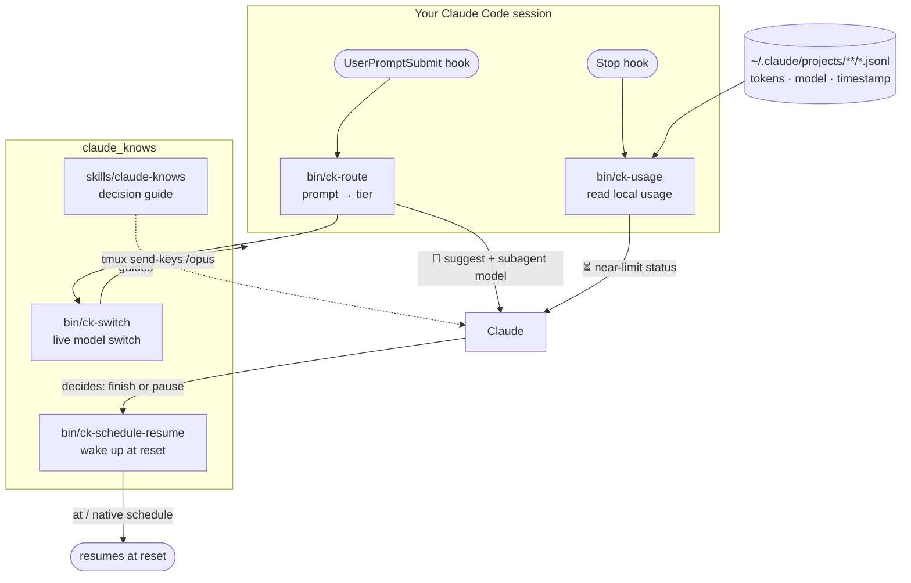
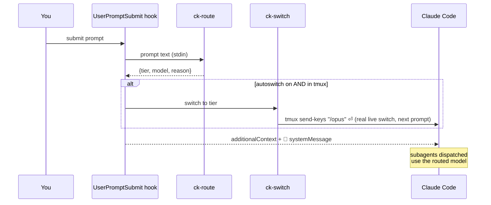
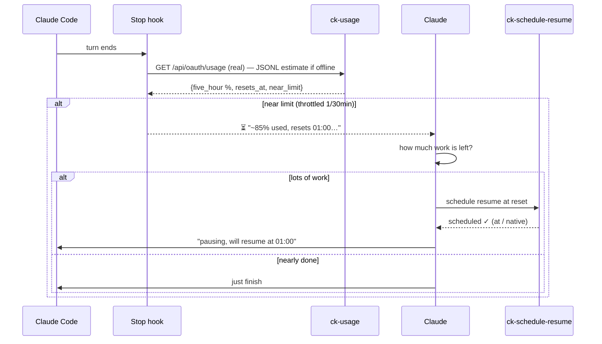

# claude_knows

**Claude Code, but it knows two things it normally doesn't: which model to use, and how close it is to its own usage limit.**

`claude_knows` is a [Claude Code](https://code.claude.com) plugin with two features:

1. **Auto model-picker** — reads every prompt and picks the right model (**Haiku / Sonnet / Opus**). When Claude Code runs inside **tmux** it *actually switches the live model*; otherwise it surfaces a one-keystroke suggestion, and it always routes dispatched subagents to the right model.
2. **Usage self-awareness** — reads your **real** 5-hour and 7-day usage % and reset times (the same `GET /api/oauth/usage` endpoint Claude Code's `/usage` uses, via your local OAuth token; a local-transcript estimate is the offline fallback), drops that status **into the chat**, and lets **Claude itself decide** whether to finish now or **schedule a resume** for when the limit resets.

> Everything here was verified against the current Claude Code docs *and* against real community tools before it was built. The honest limits are spelled out below — nothing is oversold.

---

## Why it exists

- You start a task and guess the model. Guess too big → you burn your limit on a typo fix. Guess too small → Opus-grade work gets a Haiku-grade answer. `claude_knows` picks for you.
- You're mid-migration and *slam* into your usage limit with no warning and no plan for when it comes back. `claude_knows` sees it coming and lets Claude schedule its own comeback.

---

## Architecture



## Feature 1 — how a prompt gets its model



**The router (`ck-route`)** is hybrid: fast heuristic rules decide the obvious ~90% instantly and for free (keywords like *refactor/architect/debug* → opus, *typo/rename/what is* → haiku, length + code signals for the rest). An optional Haiku tie-break (`CK_ROUTER_LLM=1`) handles genuinely ambiguous prompts. Off by default = zero per-prompt cost and latency.

## Feature 2 — usage awareness & self-resume



**`ck-usage`** calls the same server endpoint Claude Code's `/usage` uses — `GET https://api.anthropic.com/api/oauth/usage`, authenticated with the OAuth token in your local `.credentials.json` — and returns your **real** `five_hour` and `seven_day` utilization % and reset times (identical to what `/usage` shows). If the token is missing/expired or you're offline, it falls back to a **local estimate** from `~/.claude/projects/**/*.jsonl` (the ccusage approach: rolling 5-hour block vs. an auto-learned ceiling), clearly labelled as an estimate.

---

## What actually works (and what doesn't)

| Capability | Mechanism | Status |
|---|---|---|
| Read prompt → recommend model | `UserPromptSubmit` hook + `ck-route` | ✅ |
| **Live-switch the model mid-session** | `ck-switch` → `tmux send-keys "/opus"` (proven tmux-orchestration pattern) | ✅ **in tmux** |
| Switch outside tmux | `xdotool` (Linux/X11) / AppleScript (macOS) types `/model` | ✅ fragile fallback |
| Recommend + one-keystroke switch | injected `🧭` line, you press `/opus` | ✅ always |
| Route subagents to the right model | Agent/Task `model` override | ✅ |
| Read own **real** usage %, reset time | `GET /api/oauth/usage` (your OAuth token) | ✅ real |
| Usage when offline / no token | local JSONL estimate fallback | ✅ estimate |
| Put usage status in chat → Claude decides | `Stop` hook `additionalContext` | ✅ |
| Schedule a resume at reset | `ck-schedule-resume` (`at` / detached) or native `/schedule` | ✅ |
| Silently switch model by editing `settings.json` | — read once at startup, no hot-reload | ❌ next session only |
| Force `/model` from a hook | — hooks emit text/context only | ❌ |
| Real usage % / reset | `GET /api/oauth/usage` | ✅ real (offline → estimate) |

---

## Install

**One-liner (Linux & macOS):**

```bash
curl -fsSL https://raw.githubusercontent.com/CrazyMan28/claude_knows/main/install.sh | bash
```

**Or with the plugin CLI directly:**

```bash
claude plugin marketplace add https://github.com/CrazyMan28/claude_knows
claude plugin install claude-knows@claude_knows
```

**Or try it for one session, no install:** `claude --plugin-dir ~/path/to/claude_knows`

When `tmux` is installed, the one-liner also wraps `claude` so it **auto-opens in tmux with live model-switching ON** — just type `claude` and it switches models for you. Controls:
- Skip the wrapper at install time: `CK_NO_WRAPPER=1 … | bash`
- Run once without tmux: `CK_NO_TMUX=1 claude`
- Remove it later: delete the `# >>> claude_knows wrapper >>>` block from your `~/.zshrc` / `~/.bashrc`

Then **reload your shell** (`exec $SHELL`) or open a new terminal.

Requirements: `python3` (engines) + the `claude` CLI. For live switching: `tmux` (recommended) or `xdotool`/macOS. For self-resume: `at` (or a detached-timer fallback).

## Configure

Edit `config/ck.config.json` or use env vars (env wins):

| Env | Meaning | Default |
|---|---|---|
| `CK_AUTOSWITCH=1` | actually switch the live model (needs tmux/xdotool/macOS) | off (suggest only) |
| `CK_ROUTER_LLM=1` | allow a Haiku tie-break on ambiguous prompts (needs `ANTHROPIC_API_KEY`) | off |
| `CK_NEAR_LIMIT_PCT=80` | usage % that triggers the near-limit message | 80 |
| `CK_CEILING_TOKENS=N` | fixed usage ceiling instead of auto-learn | auto-learn |
| `CK_QUIET=1` | only speak when the pick differs from the default / on switch | off |

## CLI (usable standalone, too)

```bash
bin/ck-route  "refactor the auth layer"      # {"tier":"opus", ...}
bin/ck-route --pretty "fix a typo"           # /haiku  (haiku) — trivial-task keyword
bin/ck-usage  --pretty                        # your live 5h window, reset, burn rate, weekly
bin/ck-switch opus                            # switch now (tmux/xdotool/macOS), or suggest
bin/ck-schedule-resume --at +130m --prompt "continue the migration" --run
```

## Tests

```bash
tests/run.sh      # ck-route classifier + ck-usage window math (fixture-based)
```

---

## Prior art / credit

- **Model routing via tmux** — the live-switch mechanism is the same `tmux send-keys "/opus"` pattern used by community tmux-orchestration setups that already route *Haiku for research, Sonnet for implementation, Opus for architecture*.
- **Usage via JSONL** — the usage engine reads the same local transcripts as Swift menu-bar monitors like [ClaudeBar](https://github.com/tddworks/ClaudeBar) and [Claude-Usage-Tracker](https://github.com/hamed-elfayome/Claude-Usage-Tracker), and the block model mirrors [ccusage](https://github.com/ryoppippi/ccusage).

## License

MIT — see [LICENSE](LICENSE).
